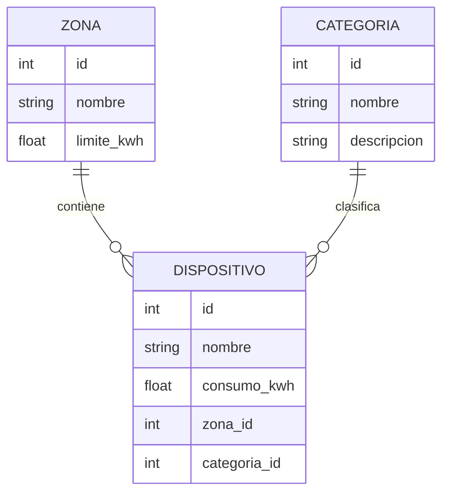

# ANALISIS.md — EcoEnergy (Fase 1)


## 1. Entidades y relaciones

| Entidad | Archivo fuente | Atributos |
| --- | --- | --- |
| Zona | `data/zonas.json` | `id`, `nombre`, `limite_kwh` |
| Categoría | `data/categorias.json` | `id`, `nombre`, `descripcion` |
| Dispositivo | `data/dispositivos.json` | `id`, `nombre`, `consumo_kwh`, `zona_id`, `categoria_id` |

### Diagrama de relaciones



### Multiplicidades

| Relación | Multiplicidad | Descripción |
| --- | --- | --- |
| Zona → Dispositivo | 1 a 0..N | Una zona puede tener cero o varios dispositivos (CA-07 cubre el caso 0). |
| Dispositivo → Zona | N a 1 | Todo dispositivo pertenece exactamente a una zona (obligatorio, no nulo). |
| Categoría → Dispositivo | 1 a 0..N | Una categoría puede clasificar cero o varios dispositivos. |
| Dispositivo → Categoría | N a 1 | Todo dispositivo pertenece exactamente a una categoría. |

## 2. Claves de conexión

No existen claves de base de datos (no hay Models/ORM); las claves son lógicas y se validan por convención dentro de los propios archivos JSON.

| Archivo | Clave primaria (lógica) | Clave foránea (lógica) | Referencia a |
| --- | --- | --- | --- |
| `zonas.json` | `id` | — | — |
| `categorias.json` | `id` | — | — |
| `dispositivos.json` | `id` | `zona_id` | `zonas.json[].id` |
| `dispositivos.json` | `id` | `categoria_id` | `categorias.json[].id` |

**Resolución en código:**
- `dispositivos/services.py` → `cargar_zonas()`, `cargar_categorias()`, `cargar_dispositivos()` leen cada JSON de forma independiente (sin relacionar aún).
- `dispositivos/views.py::listado_zonas` cruza `zona_id` contra `zona["id"]` para contar dispositivos por zona.
- `dispositivos/views.py::detalle_zona` arma `categorias_por_id = {c["id"]: c["nombre"] for c in categorias}` (diccionario de resolución O(1)) y filtra dispositivos por `d["zona_id"] == zona_id`.

## 3. Flujo de datos

```
data/*.json  →  services.py (carga)  →  views.py (filtra, relaciona, calcula)  →  templates/*.html (presenta)
```

## 4. Matriz — Criterio de aceptación | Archivo/Componente | Prueba

| Criterio de aceptación | Archivo/Componente | Prueba |
| --- | --- | --- |
| CA-01 · El listado muestra todas las zonas de `zonas.json` | `dispositivos/views.py::listado_zonas`, `dispositivos/services.py::cargar_zonas`, `templates/dispositivos/zonas.html` | Ingresar a `/zonas/` y verificar que aparece una tarjeta por cada registro de `zonas.json` (Escenario 1 y 2, sección 6). |
| CA-02 · Cada zona muestra nombre, límite, cantidad de dispositivos y acceso al detalle | `views.py::listado_zonas` (cálculo de `cantidad_dispositivos`), `zonas.html` (tarjeta + botón "Ver detalle") | Confirmar visualmente los 3 datos en cada tarjeta y que el botón navega a `/zonas/<id>/`. |
| CA-03 · El detalle muestra dispositivos, categoría, consumo, métricas y estado | `views.py::detalle_zona`, `templates/dispositivos/detalle_zona.html` | Entrar a `/zonas/1/` y verificar tabla de dispositivos (con categoría y consumo) y tarjetas de métricas (límite, consumo total, cantidad, estado). |
| CA-04 · Cantidades, sumas y estados se calculan dinámicamente (no hardcodeados en HTML) | `views.py::listado_zonas` (`sum(...)`), `views.py::detalle_zona` (`consumo_total`, `estado`) | Revisar el HTML de los templates y confirmar que no hay valores numéricos fijos; solo variables de contexto (`{{ zona.limite_kwh }}`, `{{ consumo_total }}`, etc.). |
| CA-05 · ALERTA si `consumo_total > limite_kwh`, NORMAL si `<=` | `views.py::detalle_zona` (línea `estado = "ALERTA" if consumo_total > zona["limite_kwh"] else "NORMAL"`) | Escenario 5 (sección 6): editar temporalmente `limite_kwh` o `consumo_kwh` para forzar ambos estados y confirmar el texto mostrado. |
| CA-06 · Agregar registros válidos no exige tocar Views/Templates por elemento | `services.py` (carga genérica de listas), `views.py` (recorre con `for`/`sum` sobre toda la colección) | Escenario 1 (sección 6): agregar 2 dispositivos válidos a `dispositivos.json` y confirmar que aparecen sin cambiar código. |
| CA-07 · Zona sin dispositivos se mantiene operativa y muestra mensaje comprensible | `templates/dispositivos/detalle_zona.html` (bloque `` → "Esta zona no tiene dispositivos.") | Escenario 3 (sección 6): consultar una zona sin dispositivos asociados y verificar el mensaje, sin error 500. |
| CA-08 · Identificador de zona inexistente responde 404 controlado | `views.py::detalle_zona` (`raise Http404("Zona no encontrada")`) | Escenario 4 (sección 6): solicitar `/zonas/999/` y verificar página 404 de Django, sin traza de error expuesta. |
| CA-09 · La interfaz conserva estructura y navegación al aumentar zonas/dispositivos | `templates/base.html` (nav fija), `zonas.html` (grilla Bootstrap `row/col-md-4`, se ajusta sola) | Escenario 2 (sección 6): duplicar registros válidos y confirmar que el menú y la navegación siguen accesibles. |
| CA-10 · Tablas extensas permiten desplazamiento en contenedor adaptable | `templates/dispositivos/detalle_zona.html` (`<div class="table-responsive">`) | Agregar suficientes dispositivos a una zona para que la tabla sea larga/ancha y verificar scroll interno sin desbordar la página. |
| CA-11 · Header, navegación, títulos, tablas, tarjetas, botones y mensajes con jerarquía visual coherente | `templates/base.html` (nav + `container`), `zonas.html`/`detalle_zona.html` (`h1`, `card`, `btn`) | Inspección visual de las tres vistas principales (`/`, `/zonas/`, `/zonas/<id>/`) verificando consistencia de estilos Bootstrap. |
| CA-12 · Los estados usan texto y apoyo visual, no solo color | `templates/dispositivos/detalle_zona.html` (`<span class="badge bg-danger">⚠ ALERTA</span>` / `bg-success">✓ NORMAL`) | Verificar que cada badge de estado incluye ícono + palabra, no solo el color de fondo. |
| CA-13 · El proyecto se instala desde el repositorio, ejecuta Django y supera `python manage.py check` | `requirements.txt`, `README.md`, `config/settings.py` | Clonar el repo en limpio, `pip install -r requirements.txt`, ejecutar `python manage.py check` y `python manage.py runserver`. |
